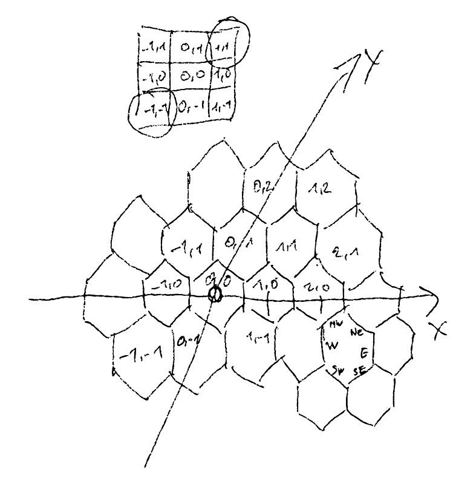

== Day 24: Lobby Layout

This solution is written as test using pytest.

The original puzzle can be found at https://adventofcode.com/2020/day/24.

For execution enter `pytest` on the command line (your working directory has to be this directory where the test is). It will pick up all files where the filename starts with `test_`.

=== Conway's World in Hex

The lobby looks a bit like the world we did on https://github.com/docToolchain/aoc-2020/tree/main/day08/pytest/cornelius[day 17]. It's two-dimensional and the elements are hexagonal, but otherwise it can be represented in the same way with a slight reinterpretation of the coordinate system.

So we'll use the `World` class we implemented on day 17 and add a new method `read_tiles`. This is all we need to express the example for the first star as a test.

[source,python,linenums]
----
include::test_solution.py[tags=test_example]
----

To get the test to pass we use the `MultiWorld` class as the now generic class `World` and implement `read_tiles` and a helper method `find_tile`. Tests pass. We are green.

[source,python,linenums]
----
include::test_solution.py[tags=example]
----

=== First Star

Now that the example works we'll feed in the puzzle data and get the answer for the first star.

[source,python,linenums]
----
include::test_solution.py[tags=star1]
----

=== Hexagonal Life

For the second star we meet the game of life again. This time it runs on our hexagonal world we implemented for the first star. The example gives us a test. Our goal is to use the `RecursiveLife` class from day 17 in a slightly generalized form as `Life`. So we want our examples from day 17 to pass and add the new example. This gives us a new test.

[source,python,linenums]
----
include::test_solution.py[tags=test_hex_example]
----

For the implementation we need to adapt the rules for survival and birth of cells and also take into account the hexagonal geometry which results in some cells not being treated as neighbors anymore. These are the adaptions required in the `Life` class. Otherwise it's identical to what we had on day 17.

[source,python,linenums]
----
include::test_solution.py[tags=hex_example]
----

Tests pass. Our refactoring is complete.

=== Second Star

Now that the examples work, we'll feed in the puzzle data again and get the answer for the second star.

[source,python,linenums]
----
include::test_solution.py[tags=star2]
----
